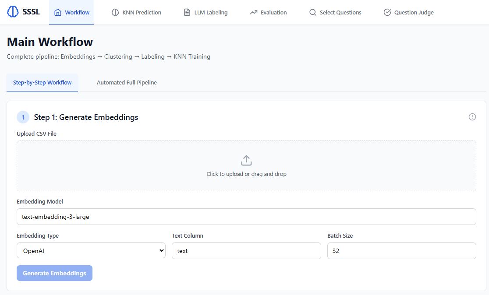
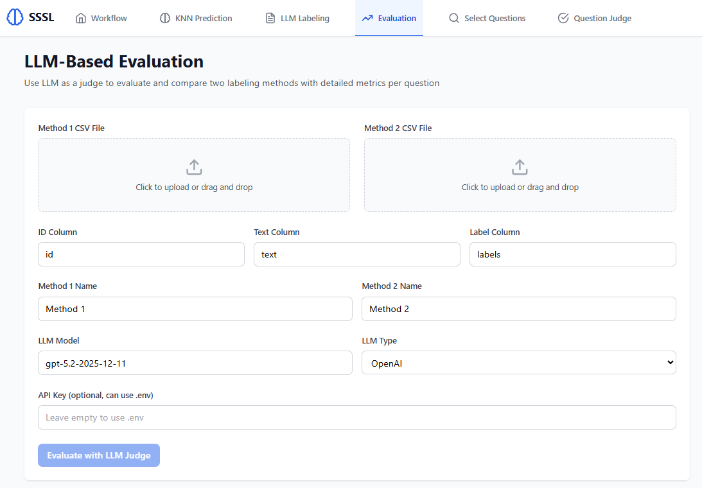
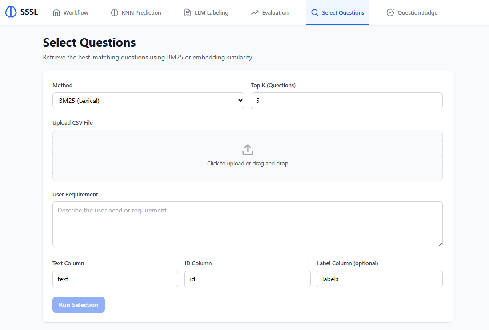
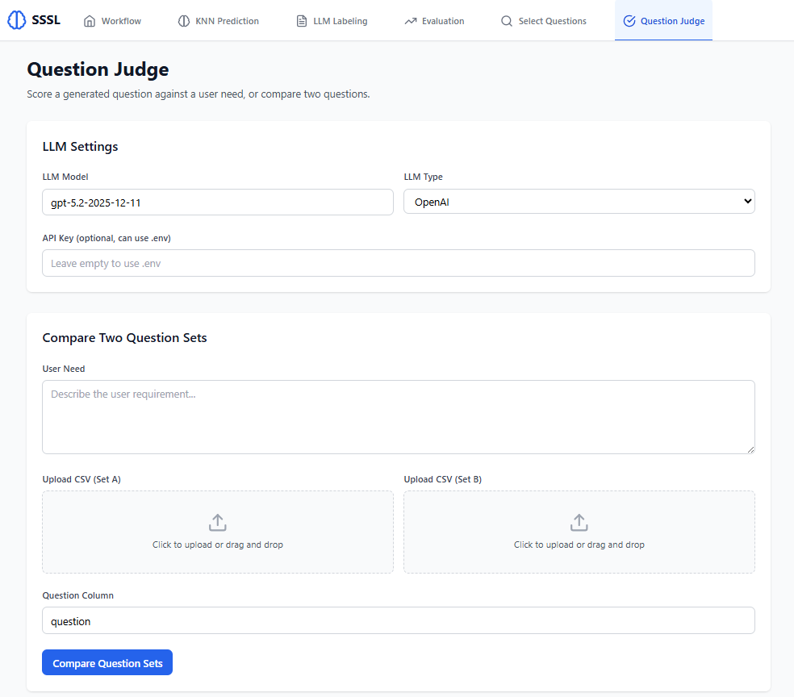

# Semi-Supervised Semantic Labeling Framework

A full-stack research platform for semi-supervised semantic labeling (SSSL) of Cybesecurity Third-Party Risk Management compliance questions. The system combines embeddings, possibilistic clustering, LLM-assisted labeling, KNN classification, and evaluation workflows in a single UI.

**Research Use Only**
This software is intended for non-commercial research, experimentation, and education. Commercial use is prohibited without explicit permission from the copyright holders.

**What This Project Does**
- Generate embeddings for questionnaire text using supported model providers.
- Cluster items with possibilistic clustering to form coherent groups.
- Produce labels with LLMs at the group or item level.
- Train KNN models for scalable label prediction.
- Compare labeling methods with an LLM-as-judge evaluation pipeline.

**Pipeline**
1. Embeddings generation.
2. Clustering and group formation.
3. LLM labeling (group-based or item-based).
4. KNN training and prediction.
5. Evaluation and comparison.

**System Overview**
- Backend: FastAPI services for embeddings, clustering, labeling, classification, evaluation, and workflow orchestration.
- Frontend: React + TypeScript UI for running the pipeline end-to-end.
- Storage: File-based artifacts in `outputs/` for embeddings, models, and labeled CSVs.

**Workflow Figure**

Figure 1. End-to-end pipeline used throughout the experiments.

**Data**
The repository includes both synthetic and real-world datasets focused on security and privacy control questionnaires.

| Split | Location | Description | Columns |
| --- | --- | --- | --- |
| Synthetic | `data/synthetic/` | ISO 27001/27002/27017/27018/27701, NIST CSF, NIST 800-53 (placeholder), SOC 2 | `id`, `text`, `title` |
| Real | `data/real/` | CSA CAIQ question set (CSV + full XLSX table) | `id`, `question` |

**Results**
Results for the research paper are generated by the evaluation and question-retrieval modules, then stored as CSVs and figures. Paper-ready artifacts can be placed in `results/` and referenced from the manuscript.
Detailed results are available in `results/stat.xlsx`.

Figure 2. LLM-as-judge comparison of two labeling methods.

Figure 3. Retrieval of relevant questions for a selected query.

Figure 4. LLM-based judging interface for per-question evaluation.

**Documentation**
- Installation and setup: `INSTALLATION.md`
- Backend API details: `backend/API_DOCUMENTATION.md`
- Backend runtime notes: `backend/README.md`
- Frontend usage notes: `frontend/README.md`

**License**
Research Use Only - Non-Commercial. See the note above and contact the maintainers for commercial licensing inquiries.
